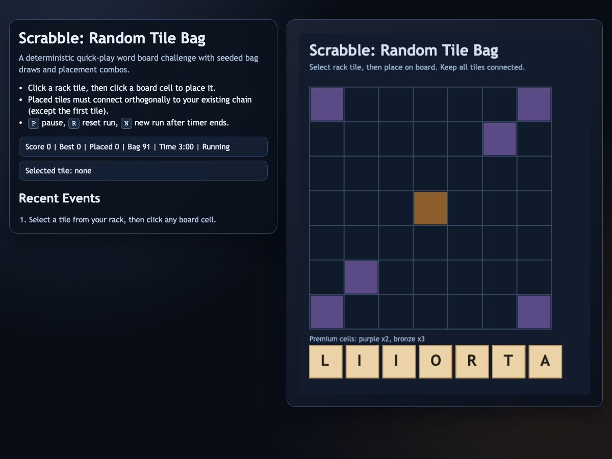

# daily-classic-game-2026-04-23-scrabble-random-tile-bag

  <h3>Deterministic Scrabble-inspired score attack with a seeded random tile bag twist.</h3>
  
Place connected letter tiles, route across premium cells, and maximize points before time expires.

  
  

## Quick Start
- `pnpm install`
- `pnpm dev`
- Open `http://127.0.0.1:4173`

## How To Play
- Click one tile in the rack.
- Click a board cell to place it.
- Keep placing tiles connected orthogonally to your existing chain.
- Use premium cells and longer runs for larger point bursts.

## Rules
- First tile can be placed anywhere.
- All later placements must touch at least one existing tile (up/down/left/right).
- Placing onto an occupied cell is a collision and costs points.
- Timer runs down continuously while unpaused.

## Scoring
- Base score uses Scrabble-style letter values.
- Premium cells multiply tile points (`x2`/`x3`).
- Horizontal or vertical run length `>=3` adds a combo bonus.
- Run length `>=5` grants an additional chain bonus.

## Twist
- **Random Tile Bag**: every run shuffles the full tile bag once using a deterministic seed.
- Rack refills from this seeded order, so identical actions produce identical outcomes.

## Verification
- `pnpm test`
- `pnpm build`
- `pnpm capture`
- Browser hooks:
  - `window.advanceTime(ms)`
  - `window.render_game_to_text()`

## Project Layout
- `src/` game loop, rendering, and core rules
- `tests/` deterministic and rules tests
- `scripts/` build, self-check, and Playwright capture
- `docs/plans/` implementation and action payload plans
- `artifacts/playwright/` generated screenshots, GIF clips, and text dumps

## GIF Captures
- `clip-01-opening-chain.gif` - opening placements and first chain bonus
- `clip-02-premium-route.gif` - premium-cell route extension
- `clip-03-endgame-rush.gif` - late-game scoring sprint
